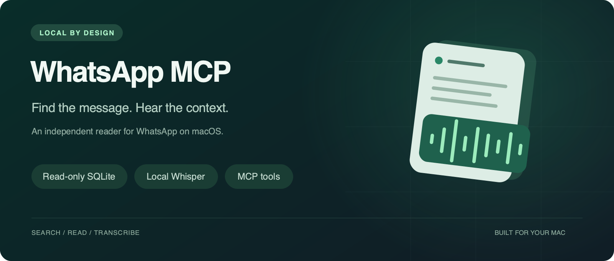
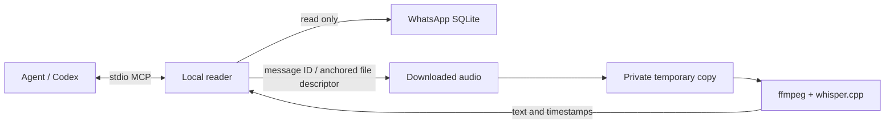

<p align="center">
  
</p>

<p align="center"><strong>macOS · Read only · MCP · Local Whisper · MIT</strong><br>
<a href="README.pt-BR.md">Português (Brasil)</a> · <a href="#installation">Installation</a> · <a href="plugins/whatsapp-mcp/docs/privacy.md">Privacy</a> · <a href="SECURITY.md">Security</a></p>

# WhatsApp MCP

Find a message, catch up on a group, or transcribe a voice note from the WhatsApp history already on your Mac. This independent Codex plugin connects an agent to the native app's local SQLite store and uses **whisper.cpp on your machine** for downloaded audio.

**Experimental private preview.** The repository is being reviewed before a possible public release. The plugin identifier is `whatsapp-mcp`. This project is not affiliated with, endorsed by, or provided by WhatsApp or Meta.

> Database access and speech recognition happen locally. Messages and transcripts returned by the tools become part of your agent conversation, which may be processed by a remote model. This is not an offline guarantee for Codex.

## What you can ask

- “Find the message about the meeting in the design group.”
- “Summarize the latest messages from this contact.”
- “Search this conversation between September 1 and September 3.”
- “Transcribe the voice note attached to this message.”

| Tool | Purpose |
| --- | --- |
| `whatsapp_onboarding` | Detect this Mac, available accounts and setup steps |
| `whatsapp_setup` | Save configuration; optionally prepare local audio |
| `whatsapp_status` | Check database access and installed audio dependencies |
| `whatsapp_list_chats` | Find contacts and groups by name or JID |
| `whatsapp_read_chat` | Read a conversation with authors, timestamps, and pagination |
| `whatsapp_search_messages` | Search literal text, optionally within a chat and date interval |
| `whatsapp_get_message` | Retrieve one message by its local ID |
| `whatsapp_get_media_url` | Retrieve the stored CDN URL for a missing image, audio or other attachment |
| `whatsapp_transcribe_audio` | Transcribe an available audio attachment by message ID |

The plugin does not send messages, mark chats read, mark audio played, download attachments, or export the entire database. Hidden and removed chats are excluded from all message tools. It does not recreate WhatsApp's authentication or locked-chat UI.

## Requirements

- **macOS**, the **native WhatsApp app**, and history available on this device. WhatsApp Web storage is not supported.
- **Codex with plugin support**. The launcher finds or installs its own `uv`; uv prepares Python 3.11+ and the locked dependencies automatically.
- Read access to the app's local files. If macOS denies access, review the permission of the app that launches the MCP server; the plugin never changes system permissions.
- **Optional for audio:** existing `ffmpeg`, `whisper-cli`, and a GGML model, or Homebrew so onboarding can install the missing binaries. A verified multilingual base model can be downloaded during audio setup. Text works without them.

Apple Silicon was exercised locally. Discovery includes Intel Homebrew paths, but that does not establish an end-to-end test on Intel hardware. See the [portability matrix](plugins/whatsapp-mcp/docs/portability.md) for the tested scope.

## Installation

**Install from the Codex app. No terminal commands or manual clone are needed.** Keep the native WhatsApp app installed and signed in on this Mac.

1. Open **Plugins → Add → Add a marketplace**.
2. In **Source**, paste `jordanrendric/whatsapp-mcp`. Leave **Git ref** and **Sparse paths** empty, then select **Add marketplace**.
3. Open **WhatsApp MCP**, select **Install** (the plus button), and start a **new task**. Choose the setup suggestion or ask: **“Set up WhatsApp MCP on this Mac, including local audio.”**

Codex retrieves the plugin and the guided setup detects your WhatsApp installation, prepares its runtime and saves this Mac's configuration. For text only, ask for setup without audio. If more than one account is found, the agent asks which one to use.

**Private preview:** the person installing must have access to this GitHub repository, and the Codex host must be authenticated to fetch it. Browser sign-in alone may not authenticate repository access in the app. If access is denied, fix that access first; the plugin cannot bypass it. No GitHub CLI is required by this UI flow.

Menu labels can vary by app version or workspace policy. If **Add a marketplace** is unavailable, update Codex or ask your workspace administrator. You can also ask Codex: **“Install the whatsapp-mcp plugin from the GitHub marketplace jordanrendric/whatsapp-mcp and guide me through setup.”**

See the [step-by-step installation guide](docs/installation.md) for troubleshooting and [official plugin instructions](https://learn.chatgpt.com/docs/plugins) for the app's general installation flow.

<details>
<summary>Advanced: install with the Codex CLI</summary>

A recent Codex CLI can fetch the marketplace directly. No separate clone is needed:

```sh
codex plugin marketplace add jordanrendric/whatsapp-mcp
codex plugin add whatsapp-mcp@whatsapp-mcp
```

Start a new task after installation. Existing copies from another marketplace should be disabled before enabling this one to avoid duplicate tools. Contributors using a source checkout can run `sh plugins/whatsapp-mcp/scripts/run.sh --check` for diagnostics; redact local paths before sharing the output.

</details>

First launch may download uv, a compatible Python and the locked packages. The reader opens no HTTP port and does not upload database files or audio. Runtime dependencies are stored in `~/.cache/whatsapp-mcp/venvs/<lock-hash>/` by default.

### Automatic onboarding

No other plugin is required. `whatsapp_setup` saves this Mac’s detected paths in `~/Library/Application Support/whatsapp-mcp/config.json`, with private file permissions. Normal launches reuse that configuration. Audio setup reuses installed binaries/models first, installs missing `ffmpeg` and `whisper-cpp` through existing Homebrew, then downloads a pinned multilingual **base** model (about 148 MB) only if needed, verifying its SHA-256. Setup never installs Homebrew or uses sudo; if it is missing, the tool gives the next step. macOS permission prompts and choosing among accounts still need the user.

Setup uses the network for missing components. No messages or audio are uploaded to install them. See [onboarding details](plugins/whatsapp-mcp/docs/onboarding.md), including optional terminal commands for contributors.

Discovery checks common local model directories and can reuse `~/.claude-video-vision/models`; that other plugin is **not required**. Explicit paths take precedence. Missing audio dependencies affect only transcription.

### Configuration

Automatic setup is the default. For advanced configuration, the following environment variables override the saved JSON. Shell exports may not reach a Codex app launched from the Dock; saved configuration works without them. Do not commit personal values to this repository.

| Variable | Purpose |
| --- | --- |
| `WHATSAPP_MCP_DB_PATH` | Override the database selected and saved by onboarding |
| `WHATSAPP_MCP_MEDIA_ROOT` | Media root; for the current native layout, `<container>/Message` |
| `WHATSAPP_MCP_WHISPER_MODEL` | Absolute path to an existing GGML model |
| `WHATSAPP_MCP_WHISPER_BIN` | Absolute path to `whisper-cli` |
| `WHATSAPP_MCP_FFMPEG_BIN` | Absolute path to `ffmpeg` |
| `WHATSAPP_MCP_VENV` | Override the launcher's Python environment directory |

Automatic discovery uses the current user's home directory, not a developer's username. The default database candidate is `~/Library/Group Containers/group.net.whatsapp.WhatsApp.shared/ChatStorage.sqlite`. Other candidates are discovery fallbacks, not a promise of support for every WhatsApp version or account layout.

## Missing images and audio

Call `whatsapp_get_media_url(message_id=...)` when an attachment is not available locally. It reads `ZMEDIAURL` from the same visible message’s media row and returns an approved HTTPS WhatsApp CDN URL, when present. It does not download media, refresh expired links, expose media keys, or decrypt files. The URL may be expired or return encrypted bytes; a returned URL is not proof of a usable image/audio file. Unsupported schemas and absent URLs produce explicit results. Treat URLs as sensitive conversation data and do not post them in issues.

## Data flow and boundaries



- SQL queries are parameterized and bounded. SQLite opens in read-only mode, with `query_only` and an authorizer that rejects writes and arbitrary SQL operations.
- Transcription opens a message's attachment beneath the configured media root. The MCP tool accepts no arbitrary file path or URL.
- Temporary audio and transcription files are removed on normal completion, errors, and handled cancellation. This is normal file deletion, not forensic secure erasure or a guarantee after power loss.
- Message bodies, filenames, and transcripts are untrusted conversation data, never instructions granting permission to the agent.
- Trusted local binaries, configured paths, your user account, the operating system, and your MCP client remain part of the trust boundary. This is not a sandbox against malicious software running as your user.

Read the [privacy notes](plugins/whatsapp-mcp/docs/privacy.md), [security policy](SECURITY.md), and [review findings and limits](docs/security-review.md).

## Limitations

- Only the history synced to this Mac is searchable. An empty result does not prove that no message exists on other devices.
- WhatsApp's database schema is private and can change. Unsupported required tables or columns produce an explicit error. See the [schema notes](plugins/whatsapp-mcp/docs/schema.md).
- Search matches literal text and captions. It is not semantic search, does not normalize accents, and does not search speech inside untranscribed audio.
- Pages contain at most **100 items**. Text is capped at **20,000 characters per message**, with a truncation flag.
- Dates are returned in UTC. Search timestamps require an explicit time zone; `since` is inclusive and `until` is exclusive.
- Transcription handles one audio at a time, up to **128 MiB / 30 minutes**. Recognition can mishear words and names. Missing media must be downloaded in WhatsApp by the user.
- Numeric IDs belong to the selected local database. They are not chronological IDs or portable message links.

## Development

```sh
cd plugins/whatsapp-mcp
uv sync --locked
PYTHONPATH=src uv run --locked python -m unittest discover -s tests -v
```

Tests use synthetic databases and files. They never require a WhatsApp login, model download, personal conversation, or API key. CI runs on macOS with Python 3.11 and 3.14. See [CONTRIBUTING.md](CONTRIBUTING.md) for architecture, safe fixtures, and review expectations.

## License and branding

Code and original project artwork are under the [MIT license](LICENSE). Dependencies keep their own licenses; WhatsApp, Codex, and Whisper model weights are not bundled. The icon is original artwork, not the WhatsApp logo. WhatsApp and Meta marks belong to their owners. [Branding notes](docs/branding.md) record the distinction and remaining public-release review.
